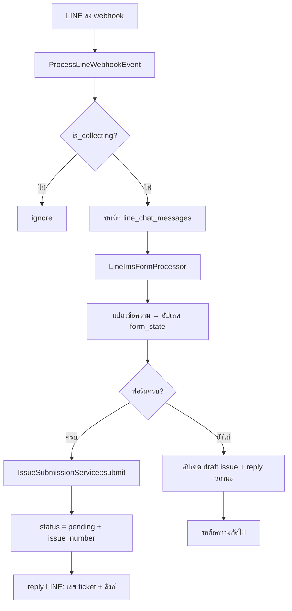

# LINE → IMS Form Automation

เอกสารนี้เป็นสเปกและ checklist สำหรับ implement ระบบที่รับข้อความจาก LINE แล้วบันทึกลงฟอร์ม **แจ้งปัญหา (Issue Create)** ของ IMS โดยอัตโนมัติ และเมื่อข้อมูลครบถ้วนให้ส่งเข้าระบบ (เปิด ticket ใน IMS) ทันที

> **ขอบเขตเอกสารนี้:** ออกแบบและ checklist เท่านั้น — ยังไม่ implement code

## เป้าหมาย

- เมื่อกลุ่ม LINE อยู่ในสถานะ `is_collecting = true` (จากระบบ webhook เดิม) ให้แปลงข้อความที่รับมาเป็นข้อมูลในฟอร์ม IMS
- รองรับ form type แรก: `issue_create` (หน้าแจ้งปัญหา)
- เก็บสถานะฟอร์มแบบ incremental จนกว่าจะครบ required fields
- เมื่อครบแล้ว ให้ submit เข้า IMS โดยอัตโนมัติ (status เปลี่ยนจาก `draft` → `pending`)
- แจ้งผลกลับในกลุ่ม LINE (เลข ticket, ลิงก์ดู issue)

## ระบบที่มีอยู่แล้ว (Baseline)

อ้างอิงจาก `docs/line-group-chat-webhook.md` — ส่วนนี้ implement เสร็จแล้ว:

| ส่วน                                            | สถานะ |
| ----------------------------------------------- | ----- |
| LINE webhook + signature verify                 | ✅    |
| คำสั่ง `@OA เริ่มเก็บข้อมูล` / `หยุดเก็บข้อมูล` | ✅    |
| บันทึกข้อความลง `line_chat_messages`            | ✅    |
| Queue job `ProcessLineWebhookEvent`             | ✅    |

ส่วนที่ **ยังไม่มี** และเป็นขอบเขตของเอกสารนี้:

- แปลงข้อความ LINE → ฟิลด์ฟอร์ม IMS
- จัดการ draft issue และ `form_state`
- ดาวน์โหลดไฟล์/รูปจาก LINE แล้วแนบใน issue
- auto-submit เมื่อฟอร์มครบ

## ฟอร์มเป้าหมาย

**URL ตัวอย่าง (local):**

```text
http://127.0.0.1:8001/issue/9c9aafbc-f74a-4e30-b44a-1209b30431ad/create
```

| ส่วน URL     | ค่า                                    | ความหมาย        |
| ------------ | -------------------------------------- | --------------- |
| `{business}` | `9c9aafbc-f74a-4e30-b44a-1209b30431ad` | UUID ของธุรกิจ  |
| route name   | `issue.create`                         | หน้าสร้าง issue |

**View:** `resources/views/public/issue/create.blade.php`

### ฟิลด์ในฟอร์ม (form type: `issue_create`)

| ฟิลด์ (UI)   | name               | required ตอน submit | หมายเหตุ                                                                    |
| ------------ | ------------------ | ------------------- | --------------------------------------------------------------------------- |
| เรื่อง       | `title`            | ✅                  | สูงสุด 255 ตัวอักษร                                                         |
| ความเร่งด่วน | `priority`         | ✅                  | `low` / `medium` / `high`                                                   |
| โปรเจค       | `issue_project_id` | ❌ (public user)    | แสดงเฉพาะพนักงาน (`$isIssueEmployee`) — LINE flow ใช้ public path ไม่บังคับ |
| แนบไฟล์      | `files[]`          | ❌                  | path ใน storage หลัง upload                                                 |
| แนบลิงก์     | `url`              | ✅\*                | ต้องมี URL หรือเลือก "ไม่มี URL" (ส่ง `url` เป็น `null`)                    |
| รายละเอียด   | `comment`          | ❌                  | validation อนุญาตว่าง แต่ควรเก็บจาก LINE                                    |

**Validation อ้างอิง:** `IssueController::issueSubmitRules()`

```php
'title'    => 'required|string|max:255',
'priority' => 'required|in:low,medium,high',
'url'      => 'nullable|url|max:2048',  // null = ไม่มี URL
'comment'  => 'nullable|string',
'files'    => 'nullable|array',
```

### API ที่ฟอร์ม web ใช้อยู่ (อ้างอิงสำหรับ service layer)

| Action             | Method | Route                              | หมายเหตุ                       |
| ------------------ | ------ | ---------------------------------- | ------------------------------ |
| บันทึกแบบร่าง      | POST   | `/issue/{business}/draft`          | `issue.draft.save` — ต้อง auth |
| ส่งเข้าระบบ (ใหม่) | POST   | `/issue/{business}/store-submit`   | `issue.store.submit`           |
| ส่งแบบร่าง         | POST   | `/issue/{business}/{issue}/submit` | `issue.submit`                 |
| อัปโหลดไฟล์        | POST   | `/issue/{business}/upload`         | `issue.upload`                 |

> **สำคัญ:** route เหล่านี้อยู่ภายใต้ middleware `auth` — การ submit จาก LINE ต้องใช้ **service layer ภายใน** ไม่ควรเรียก HTTP endpoint ของตัวเองโดยตรง

## Flow ภาพรวม



## การผูกกลุ่ม LINE กับ Business / Form Type

ขยาย `line_chat_sources` (model มี field แล้ว แต่ migration ยังไม่ครบ):

| column           | type            | คำอธิบาย                                |
| ---------------- | --------------- | --------------------------------------- |
| `business_id`    | uuid nullable   | FK → `business.id` — default จาก env    |
| `form_type`      | string nullable | เช่น `issue_create`                     |
| `draft_issue_id` | bigint nullable | FK → `issues.id` (แบบร่างที่กำลังกรอก)  |
| `form_state`     | json nullable   | สถานะฟอร์มชั่วคราว (ดู schema ด้านล่าง) |

**ค่าเริ่มต้นเมื่อ start collecting:**

- `business_id` = `config('services.line.ims.default_business_id')` หรือ `9c9aafbc-f74a-4e30-b44a-1209b30431ad`
- `form_type` = `LineChatSource::FORM_TYPE_ISSUE_CREATE` (`issue_create`)
- สร้าง draft issue ใหม่ หรือ reuse `draft_issue_id` ถ้ายังเป็น `draft`

### Schema `form_state` (issue_create)

```json
{
    "title": null,
    "priority": "medium",
    "url": null,
    "no_url": false,
    "comment": "",
    "files": [],
    "missing_fields": ["title", "url_or_no_url"],
    "last_message_id": null,
    "submitted_issue_id": null,
    "submitted_at": null
}
```

## กฎการแมปข้อความ LINE → ฟิลด์ฟอร์ม

### 1. ข้อความ text

| รูปแบบข้อความ                       | แมปไปที่                      | ตัวอย่าง                             |
| ----------------------------------- | ----------------------------- | ------------------------------------ |
| บรรทัดแรก / ข้อความสั้น             | `title`                       | `ระบบ login ไม่ได้`                  |
| มี URL (`https?://...`)             | `url`                         | ดึงด้วย regex                        |
| คำว่า "ไม่มี url" / "no url"        | `no_url = true`, `url = null` | checkbox equivalent                  |
| คำว่า "เร่งด่วน" / "urgent"         | `priority = high`             |                                      |
| คำว่า "ปกติ" / "normal"             | `priority = medium`           | default                              |
| คำว่า "ต่ำ" / "low"                 | `priority = low`              |                                      |
| ข้อความยาว / หลายบรรทัด             | `comment` (append)            | รวม sender + timestamp               |
| ข้อความที่มีทั้ง title + รายละเอียด | แยกด้วย newline แรก           | บรรทัด 1 → title, ที่เหลือ → comment |

**กลยุทธ์แนะนำ (Phase 1 — ง่าย):**

1. ข้อความแรกหลัง start → ตั้ง `title` (ตัดที่ 255 ตัวอักษร)
2. ข้อความถัดไป → append ลง `comment`
3. ถ้าพบ URL ในข้อความใดก็ตาม → ตั้ง `url`
4. ถ้าไม่พบ URL หลังครบ N ข้อความ หรือได้รับคำสั่ง `ไม่มี url` → ตั้ง `no_url = true`

**กลยุทธ์ Phase 2 (structured):**

รองรับคำสั่งแท็ก OA แบบมี label:

```text
@OA เรื่อง: ระบบ login ไม่ได้
@OA ลิงก์: https://example.com/page
@OA ความเร่งด่วน: เร่งด่วน
@OA รายละเอียด: กด login แล้ว error 500
@OA ส่ง          ← บังคับ submit ถ้าครบ
@OA รีเซ็ต       ← เริ่มฟอร์มใหม่
```

### 2. ข้อความ image / file / video

| message_type | การจัดการ                                                                                              |
| ------------ | ------------------------------------------------------------------------------------------------------ |
| `image`      | ดาวน์โหลดผ่าน LINE Content API → เก็บ `storage/app/public/issue/{business}/` → เพิ่ม path ใน `files[]` |
| `file`       | เหมือน image (ถ้า OA รองรับ)                                                                           |
| `video`      | ดาวน์โหลด + validate mime ตาม `issue.upload`                                                           |
| `sticker`    | ไม่นับเป็นข้อมูลฟอร์ม — อาจ reply ว่าไม่รองรับ                                                         |
| `location`   | แปลงเป็น text ใน `comment` (lat/lng + label)                                                           |

**LINE Content API:**

```http
GET https://api-data.line.me/v2/bot/message/{messageId}/content
Authorization: Bearer {LINE_CHANNEL_ACCESS_TOKEN}
```

### 3. ข้อความที่เป็น command เดิม

| Command           | พฤติกรรมเดิม    | พฤติกรรมใหม่ (เสนอ)                                 |
| ----------------- | --------------- | --------------------------------------------------- |
| `เริ่มเก็บข้อมูล` | เปิด collecting | + สร้าง draft issue + reset `form_state`            |
| `หยุดเก็บข้อมูล`  | ปิด collecting  | + ถ้ามี draft ยังไม่ submit ให้เก็บไว้หรือแจ้งเตือน |

## เงื่อนไข "ฟอร์มครบถ้วน"

สำหรับ `issue_create` (public user):

```text
ครบเมื่อ:
  - title ไม่ว่าง (trim แล้ว length > 0)
  - priority มีค่า (default medium ได้)
  - (url เป็น valid URL) OR (no_url === true)
```

**ไม่บังคับ:** `comment`, `files`, `issue_project_id`

เมื่อครบและ `config('services.line.ims.auto_submit') === true`:

1. เรียก `IssueSubmissionService::submitFromDraft($draftIssue)`
2. อัปเดต `form_state.submitted_issue_id` และ `submitted_at`
3. เคลียร์ `draft_issue_id` หรือเก็บ reference ไว้ใน `form_state`
4. Reply LINE พร้อม issue number และลิงก์ `route('issue.view', [$business, $issue->id])`

## Service Layer ที่ต้องสร้าง (แนะนำ)

```text
app/Services/Line/Ims/
├── LineImsFormProcessor.php       # orchestrator หลัก เรียกจาก ProcessLineWebhookEvent
├── IssueCreateFormMapper.php      # แปลง message → partial form data
├── IssueCreateFormCompleter.php   # ตรวจ missing fields
├── LineContentDownloader.php      # ดาวน์โหลดไฟล์จาก LINE
└── IssueSubmissionService.php     # สร้าง/อัปเดต draft + submit (ไม่ผ่าน HTTP)

app/Jobs/
└── ProcessLineImsFormMessage.php  # optional แยก job ถ้า download ช้า
```

### `IssueSubmissionService` — หน้าที่

ทำ logic เดียวกับ `IssueController::storeAndSubmit()` / `submitDraft()` แต่:

- ใช้ `created_by` = `config('services.line.ims.system_user_id')` (system user)
- ไม่ต้อง `Auth::login()`
- reuse validation rules จาก `issueSubmitRules()`
- ใช้ transaction เหมือน controller

### จุดเชื่อมใน Job เดิม

ใน `ProcessLineWebhookEvent::handle()` หลัง `LineChatMessage::firstOrCreate(...)`:

```php
// pseudo-code — ยังไม่ implement
if ($chatSource->is_collecting && $chatSource->form_type === LineChatSource::FORM_TYPE_ISSUE_CREATE) {
    app(LineImsFormProcessor::class)->process($chatSource, $this->event);
}
```

## Environment Variables

เพิ่มใน `.env` / `.env.example`:

```env
# IMS integration สำหรับ LINE
LINE_IMS_DEFAULT_BUSINESS_ID=9c9aafbc-f74a-4e30-b44a-1209b30431ad
LINE_IMS_SYSTEM_USER_ID=1
LINE_IMS_AUTO_SUBMIT=true
```

| ตัวแปร                         | คำอธิบาย                                                        |
| ------------------------------ | --------------------------------------------------------------- |
| `LINE_IMS_DEFAULT_BUSINESS_ID` | business UUID สำหรับสร้าง issue จาก LINE                        |
| `LINE_IMS_SYSTEM_USER_ID`      | user ID ในระบบที่เป็น `created_by` ของ issue จาก LINE           |
| `LINE_IMS_AUTO_SUBMIT`         | `true` = submit อัตโนมัติเมื่อฟอร์มครบ, `false` = เก็บแค่ draft |

> `config/services.php` มี section `line.ims` อยู่แล้ว — ต้องเพิ่มค่าใน `.env.example` และสร้าง system user ใน DB

## ข้อความตอบกลับ LINE (Reply Templates)

| เหตุการณ์               | ข้อความตัวอย่าง                                      |
| ----------------------- | ---------------------------------------------------- |
| เริ่มเก็บ + สร้าง draft | `เริ่มรับแจ้งปัญหาแล้ว กรุณาส่งหัวข้อปัญหา`          |
| อัปเดตฟิลด์             | `บันทึกแล้ว — เรื่อง: {title} \| ยังขาด: {missing}`  |
| ฟอร์มครบ + กำลัง submit | `กำลังส่งเข้าระบบ...`                                |
| submit สำเร็จ           | `แจ้งปัญหาสำเร็จ\nIssue #{issue_number}\n{view_url}` |
| validation fail         | `ส่งไม่สำเร็จ: {error}`                              |
| รูปแนบสำเร็จ            | `แนบไฟล์แล้ว ({count} ไฟล์)`                         |

ใช้ `LineMessagingClient::replyText()` สำหรับ command ทันที และ `pushMessage` สำหรับแจ้งผลหลัง submit (เพราะ reply token หมดอายุ)

## Security & Data

- ข้อความ LINE อาจมีข้อมูลส่วนบุคคล — กำหนด retention policy สำหรับ `line_chat_messages`
- system user ควรมี role จำกัด ใช้เฉพาะสร้าง issue จาก LINE
- validate URL ก่อนบันทึก (ป้องกัน javascript: / data: scheme)
- จำกัดขนาดไฟล์ตาม `issue.upload` (max 50MB)
- log การ submit จาก LINE แยกจาก user submit ปกติ (audit trail)

## Edge Cases

| กรณี                              | การจัดการ                                                               |
| --------------------------------- | ----------------------------------------------------------------------- |
| ส่งข้อความซ้ำ (redelivery)        | ใช้ `webhook_event_id` — ไม่ process ซ้ำ                                |
| มี draft ค้างอยู่ แล้ว start ใหม่ | ถามทาง policy: reset draft หรือต่อจากเดิม                               |
| submit สำเร็จแล้วยังส่งข้อความต่อ | สร้าง draft ใหม่หรือแจ้งว่าส่งแล้ว                                      |
| หลายคนส่งพร้อมกันในกลุ่ม          | ใช้ draft เดียวต่อ `line_chat_source` — append comment พร้อมระบุ sender |
| ไม่มี URL และไม่บอก "ไม่มี url"   | รอจนกว่าจะได้ URL หรือได้รับคำสั่งชัดเจน / timeout policy               |
| `auto_submit = false`             | เก็บ draft + ส่งลิงก์ `issue.create?draft={id}` ให้ user กดส่งเอง       |

---

## Implementation Checklist

### Phase 0 — เตรียมความพร้อม ✅

- [x] **0.1** ยืนยัน business UUID `9c9aafbc-f74a-4e30-b44a-1209b30431ad` มีอยู่ใน DB
- [x] **0.2** สร้าง/ระบุ system user สำหรับ `LINE_IMS_SYSTEM_USER_ID` (user id `1`, `test@example.com`)
- [x] **0.3** เพิ่ม env ใน `.env.example`: `LINE_IMS_DEFAULT_BUSINESS_ID`, `LINE_IMS_SYSTEM_USER_ID`, `LINE_IMS_AUTO_SUBMIT`
- [x] **0.4** ทดสอบฟอร์ม manual ที่ `/issue/{business}/create` ให้ submit สำเร็จก่อน (baseline)

### Phase 1 — Database & Model ✅ (2026-07-10)

- [x] **1.1** สร้าง migration เพิ่ม column ใน `line_chat_sources` (2026-07-10)
    - `business_id` (uuid, nullable, index)
    - `form_type` (string, nullable)
    - `draft_issue_id` (foreignId → issues, nullable)
    - `form_state` (json, nullable)
- [x] **1.2** รัน `php artisan migrate` (2026-07-10)
- [x] **1.3** อัปเดต `LineChatSource` model — relationship `draftIssue()`, `business()`, cast `form_state`, `defaultIssueCreateFormState()` (2026-07-10)
- [x] **1.4** สร้างตาราง `line_ims_submissions` สำหรับ audit log + model `LineImsSubmission` (2026-07-10)

### Phase 2 — Core Services ✅ (2026-07-10)

- [x] **2.1** สร้าง `IssueSubmissionService`
    - [x] `createOrUpdateDraft(businessId, userId, array $data): Issue`
    - [x] `submitDraft(Issue $issue, array $data): Issue`
    - [x] reuse validation จาก `issueSubmitRules()`
- [x] **2.2** สร้าง `IssueCreateFormMapper`
    - [x] `mapTextMessage(string $text, array $currentState): array`
    - [x] `extractUrl(string $text): ?string`
    - [x] `detectPriority(string $text): ?string`
    - [x] `detectNoUrlIntent(string $text): bool`
- [x] **2.3** สร้าง `IssueCreateFormCompleter`
    - [x] `missingFields(array $state): array`
    - [x] `isComplete(array $state): bool`
- [x] **2.4** สร้าง `LineContentDownloader`
    - [x] ดาวน์โหลดจาก LINE Content API
    - [x] เก็บไฟล์ที่ `issue/{business}/` เหมือน `IssueController::upload()`
- [x] **2.5** สร้าง `LineImsFormProcessor` (orchestrator)
    - [x] โหลด/สร้าง draft issue
    - [x] อัปเดต `form_state` + sync ลง `issues` / `issue_comments`
    - [x] เรียก submit เมื่อครบ
    - [x] ส่ง reply/push กลับ LINE

### Phase 3 — เชื่อมกับ LINE Webhook ✅ (2026-07-10)

- [x] **3.1** ขยาย `LineCommandParser` (optional)
    - [x] คำสั่ง `ส่ง` / `submit`
    - [x] คำสั่ง `รีเซ็ต` / `reset`
    - [x] คำสั่งแบบ `เรื่อง:`, `ลิงก์:` (Phase 2 — ผ่าน `IssueCreateFormMapper`)
- [x] **3.2** แก้ `ProcessLineWebhookEvent`
    - [x] เมื่อ START: ตั้ง `business_id`, `form_type`, สร้าง draft, reset `form_state`
    - [x] เมื่อ STOP: (optional) แจ้งสถานะ draft ค้าง
    - [x] หลังบันทึก message: dispatch `LineImsFormProcessor`
- [x] **3.3** รองรับ non-text message (image/file) ใน processor
- [x] **3.4** ป้องกัน process ซ้ำจาก redelivery (เช็ค `webhook_event_id` ก่อน process form)

### Phase 4 — ขยาย LINE Client

- [ ] **4.1** เพิ่ม `LineMessagingClient::pushText(groupId, text)` สำหรับแจ้งผลหลัง submit
- [ ] **4.2** กำหนดข้อความ template ตามตาราง Reply Templates

### Phase 5 — Testing

- [ ] **5.1** Unit test `IssueCreateFormMapper` — แยก title/comment/url/priority
- [ ] **5.2** Unit test `IssueCreateFormCompleter` — missing fields / isComplete
- [ ] **5.3** Unit test `IssueSubmissionService` — สร้าง draft + submit
- [ ] **5.4** Feature test: ข้อความ text เดียวครบ (title + url) → issue `pending`
- [ ] **5.5** Feature test: หลายข้อความสะสม → draft อัปเดต → submit เมื่อครบ
- [ ] **5.6** Feature test: `no_url` intent → submit ด้วย `url = null`
- [ ] **5.7** Feature test: redelivery ไม่ submit ซ้ำ
- [ ] **5.8** Feature test: image message → ไฟล์อยู่ใน `issue_comments.files`
- [ ] **5.9** รัน `php artisan test`

### Phase 6 — Manual / LINE Console Testing

- [ ] **6.1** ตั้งค่า env ครบ + `php artisan queue:work`
- [ ] **6.2** ส่ง `@OA เริ่มเก็บข้อมูล` ในกลุ่ม
- [ ] **6.3** ส่งหัวข้อปัญหา (text)
- [ ] **6.4** ส่ง URL หรือ `ไม่มี url`
- [ ] **6.5** ส่งรายละเอียดเพิ่ม (optional)
- [ ] **6.6** ส่งรูปภาพแนบ (optional)
- [ ] **6.7** ตรวจ DB: `issues.status = pending`, มี `issue_number` จริง
- [ ] **6.8** ตรวจหน้า IMS `/issue/{business}/view/{id}` แสดงข้อมูลถูกต้อง
- [ ] **6.9** ตรวจข้อความตอบกลับในกลุ่ม LINE
- [ ] **6.10** ส่ง `@OA หยุดเก็บข้อมูล` และยืนยันพฤติกรรม

### Phase 7 — Production Readiness

- [ ] **7.1** กำหนดนโยบาย draft ค้าง (timeout / auto-reset)
- [ ] **7.2** กำหนด retention สำหรับ `line_chat_messages`
- [ ] **7.3** เพิ่ม monitoring/log สำหรับ submit fail
- [ ] **7.4** อัปเดต `docs/line-group-chat-webhook-test-results.md` หลังทดสอบจริง
- [ ] **7.5** (optional) รองรับ form type อื่นในอนาคต — ออกแบบ `FormTypeHandler` interface

---

## ลำดับ Implement แนะนำ

```text
1. Migration + env + system user          (Phase 0–1)
2. IssueSubmissionService                 (Phase 2.1) — ทดสอบแยกก่อน
3. FormMapper + FormCompleter             (Phase 2.2–2.3)
4. LineImsFormProcessor                   (Phase 2.5)
5. เชื่อม ProcessLineWebhookEvent         (Phase 3)
6. LineContentDownloader + image support  (Phase 2.4, 3.3)
7. Push message + reply templates         (Phase 4)
8. Tests + LINE manual test               (Phase 5–6)
```

## เอกสารที่เกี่ยวข้อง

- [LINE Group Chat Webhook](./line-group-chat-webhook.md) — webhook พื้นฐาน (implement แล้ว)
- [LINE Webhook Test Results](./line-group-chat-webhook-test-results.md)
- [LINE → IMS Form Automation Test Results](./line-to-ims-form-automation-test-results.md)
- Form UI: `resources/views/public/issue/create.blade.php`
- Issue API: `app/Http/Controllers/IssueController.php`
- LINE Job: `app/Jobs/ProcessLineWebhookEvent.php`
